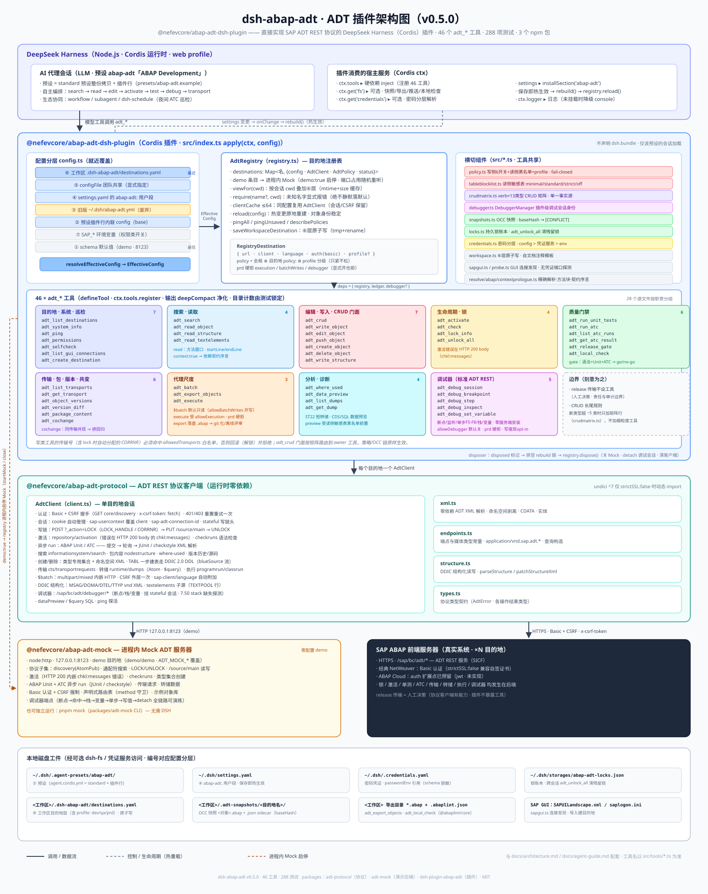
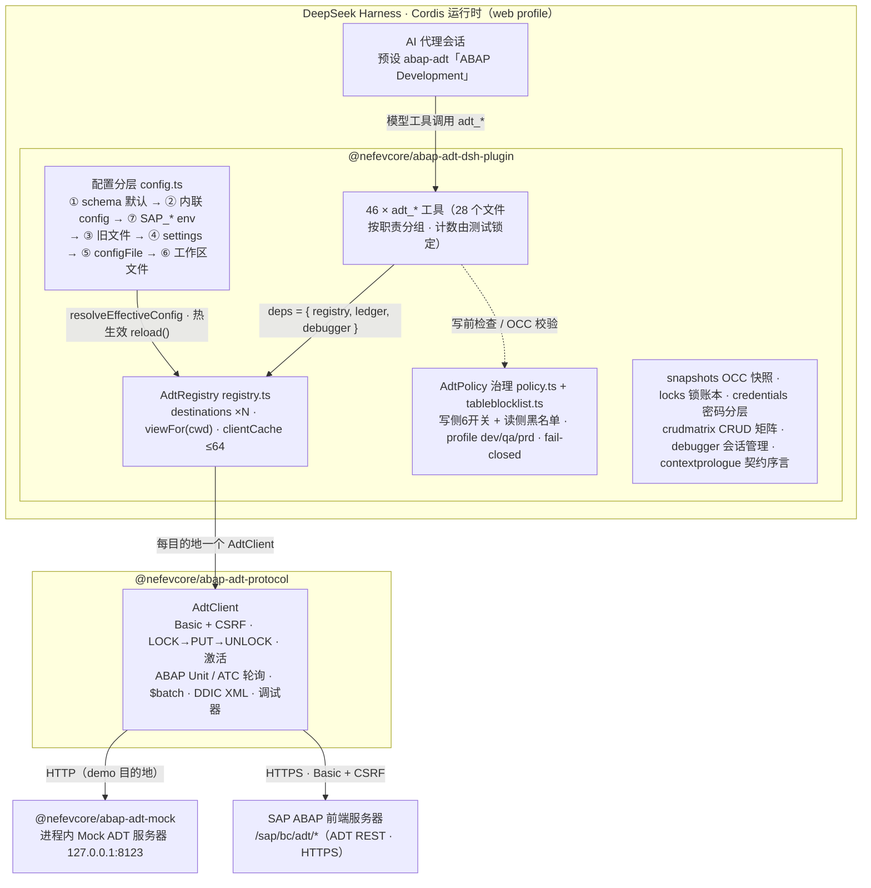

# 架构

> 高分辨率矢量图见 [`architecture-diagram.svg`](architecture-diagram.svg)（浏览器 / 编辑器直接打开）；下图是同一结构的 Mermaid 概览，便于在 GitHub 内联渲染与维护。

> 按「建请求 → 建 DDIC → 写码 → 激活 → 测试 → 释放」开发流程组织的全工具映射图见 [`dev-workflow.md`](dev-workflow.md) / [`dev-workflow.svg`](dev-workflow.svg)。

## 分层

### 1. `@nefevcore/abap-adt-protocol` — 协议客户端（运行时仅 undici 依赖，懒加载）
- `AdtClient`：单目的地 HTTP 客户端。封装认证（Basic）、CSRF 握手与重试、会话 cookie 管理（含 `sap-usercontext` 强制覆盖）、`sap-adt-connection-id` / stateful 会话头
- 高层操作：discover / systemInfo / search / readSource / writeSource / lock / unlock / updateSource / activate / check / runUnitTests（异步轮询）/ runAtc（异步轮询）/ listAtcRuns / getAtcResult / getVersions / transports / packageContent / createObject / deleteObject / ping
- `xml.ts`：为 ADT XML 载荷优化的零依赖解析器（命名空间剥离、CDATA、实体）
- 唯一运行时依赖 `undici ^7`（package.json 声明），仅在 `strictSSL:false` 目的地首次使用时动态 import（自签名/私有 CA 前端）；默认路径运行时零第三方依赖

### 2. `@nefevcore/abap-adt-mock` — 内存版 ADT 服务器
- 实现协议子集：AtomPub discovery、通配符搜索、`_action=LOCK/UNLOCK`、`/source/main` 读写、激活（HTTP 200 内嵌 `chkl:messages` 错误）、checkruns、ABAP Unit 异步 run（JUnit 结果）、ATC 异步 run（checkstyle 结果）、传输请求、类型专用创建集合、nodestructure
- 带示例对象库（类/接口/程序/CDS + 单测与 ATC 数据），支持 Basic auth 校验与 CSRF 强制

### 3. `@nefevcore/abap-adt-dsh-plugin` — DSH (Cordis) 插件
- 包**不声明** `dsh.bundle`：安装只是放进 profile 依赖；启用走**预设行**——`abap-adt-preset` CLI 从 `standard` 预设拷贝生成 `~/.dsh/.agent-presets/<id>/`(剔除 `tool-cordis`/`skill-filesystem` 行)并追加本插件的行,只有该预设的会话加载 `adt_*` 工具
- `apply(ctx, config)`：构建 registry（含 `AdtPolicy` 权限策略）→ 注册全部工具 → 返回 fiber disposer（卸载时关闭 mock）;仅硬依赖 `tools` 服务,`fs` 为可选服务(逐调用 `ctx.get('fs')`,缺失时文件系统能力优雅降级)
- **权限管控（`policy.ts`）**：所有修改类工具在执行前断言策略规则（传输开关 / 允许的传输号 glob / 可传输编辑开关 / 允许的包 glob / 代码执行开关 / batch 写开关），生效值来自 config > `SAP_*` 环境变量 > 默认值；拒绝时抛 `[POLICY]` 错误并自动回滚（如写操作解锁、create 删除回建对象）。包名解析以**后端搜索精确命中**为准，调用方 `packageName` hint 仅在后端查不到时兜底，无法确定时失败关闭；write/edit/push/delete/activate/write_structure 解析对象时强制精确命中（拼错名报错列候选，绝不模糊落到别的对象）
- 工具按职责分文件（system/destinations/search/read/write/objects/lifecycle/testing/atc_runs/transport/packages/batch/local/whereused/datapreview/lock/versions/gate/policy/dumps/execute/structure/crud/debugger/selfcheck/textelements/cochange，共 28 个），统一通过 `defineTool` 声明参数/输出 schema 与 render；共享参数规格与对象解析/权限门助手收敛在 `tools/common.ts`
- **v0.5.0 代理体验升级**：方法级读取/编辑（`method` 窗口 + 依赖契约序言 `context:true`，`abap.ts`/`contextprologue.ts`）；`adt_crud` verb×type 门面（`crudmatrix.ts` 单一事实源，路由到 owner 工具原样执行——策略/OCC 链不绕过，`routedTool` 回显）；`adt_debug_*` 五件套走**标准 ADT REST 调试器**（`/sap/bc/adt/debugger/*` 零服务端安装；`DebuggerManager` 插件级会话身份——一个 ADT 会话一个调试会话、detach 后不可重 attach；`allowDebugger` 默认关 + 写变量值再需 `allowDebugVariables` 双重 opt-in；`profile: prd` 硬拒整族）；读侧治理（`tableblocklist.ts` 敏感表四档 minimal/standard/strict/off + `blockedTables` 自定义 + `allowedTables` 豁免带审计 note）；目的地 `profile: dev|qa|prd` 环境分级（qa 收紧未显式配置的 execution/batchWrites/debugger，prd 硬拒三者）；TABL 一步建表（`fields` 清单 → DDIC 2.0 DDL · blueSource 流）；`adt_selfcheck` 只读能力巡检（oracle 交叉验证，未巡检工具显式列出）；`adt_cochange` 传输共变分析；`adt_read_textelements` 文本元素读取（写侧待真实系统验证）

## 关键设计决策

1. **直接实现协议，而非桥接任何 IDE**：不依赖 IDE 或 SAP 闭源库，可 headless 运行，天然支持批量与自动化
2. **零配置 demo**：插件内置 mock 服务器，开箱即用；真实系统通过 `destinations` 配置接入（走 DSH settings：schema 注册为 `abap-adt` 命名空间，插件行 config 为 composition base，`~/.dsh/settings.yaml` 的 `abap-adt:` 段为用户层且**热生效**；显式 `configFile` 为团队共享的最权威层；分层就近覆盖：settings 用户段 > 内联 config > 旧版独立文件（已废弃）> schema 默认值，权限六开关另有 `SAP_*` 环境变量兜底；`destinations` 跨层按名字合并）。**工作区层**（`<会话 cwd>/.dsh-abap-adt/destinations.yaml`）是最近的覆盖层：预设的挂载是跨会话共享的 standing mount，所以工作区文件在**每次工具调用时**按 `exec.agent.session.header.cwd` 叠加解析（`registry.viewFor`，mtime+size 缓存 + AdtClient 复用），同名目的地/defaultDestination/权限键就近生效；`adt_create_destination` 原子写入该文件（并支持从本机 SAP GUI 的 `SAPUILandscape.xml` 导入连接；端口约定推导的 URL 视为**未验证猜测**——工具默认无凭证探测候选组合 `443<nn>`/`443`/`80<nn>`/`80` 并采用真正应答者，无可用端点时**拒绝创建**（`force` 可强制保存并标记 unverified；`ping: true` 则保存前带凭证 ping，连接级失败同样拒绝、HTTP 级失败仅警告），saprouter 条目明确标注 HTTP 无法走 GUI 的路由器、引导索要 web dispatcher url——企业 saprouter 的 ACL 通常只放行 DIAG/NI 模式，HTTP 隧道实践上不可用，已实测验证后移除内置 NI 隧道）；文件按自文档格式渲染——已设键为真实行、其余可配置项以注释模板（含默认值与用途）随文件写回，便于手工维护，写入走 RAW 解析所以不会把 schema 默认值物化进文件）
3. **异步 run 流程**：ABAP Unit / ATC 都是"提交 → 轮询 → 取结果"，客户端完整实现轮询循环与超时
4. **协议正确性优先**：错误处理覆盖 ADT 特有语义（激活错误在 200 body、exc:exception 错误体、403 CSRF/锁冲突区分、412 ETag）
5. **沙箱感知**：导出工具走可选的 `ctx.get('fs')` 服务，遵守 DSH 文件沙箱策略（无该服务的精简 profile 上优雅降级，不影响其余工具）
6. **权限管控（fail-closed）**：修改类工具先过策略再动 SAP；后端在 lock 时自动分配的传输号（CORRNR）同样受 `allowedTransports` 约束，不匹配即回滚；包名无法确定时拒绝而不是放行。读侧同理——`adt_data_preview` 发请求前过敏感表黑名单（拒绝写明类别与原因，无逐调用逃生口）；目的地 `profile: prd` 对 execution / batchWrites / debugger 硬拒（显式开启也拒）

## 批量与门禁功能（代理尺度）

| 工具 | 价值 |
|---|---|
| `adt_batch` | 协议级 $batch：多个 ADT 请求一次 HTTP 往返（默认只读 GET 扇出；写部分需 `allowBatchWrites` 开关） |
| `adt_execute` | 在系统上运行程序 / `if_oo_adt_classrun` 类并取回控制台输出（写→激活→执行→观察闭环） |
| `adt_list_dumps` / `adt_get_dump` | ST22 短转储错误分析（列表 + 三种视图详情） |
| `adt_read_structure` / `adt_write_structure` | DDIC 结构化编辑器：MSAG/DOMA/DTEL/TTYP 的元数据级读写（read-modify-write 保属性） |
| `adt_release_gate` | 预发布门禁：一次跑完语法 + ABAP Unit + ATC，输出 go/no-go，验证通过才 release |
| `adt_export_objects` | 把包/对象集源码落盘为 `.abap` 文件（带类型后缀，abaplint 兼容），支持 git 版本化、离线评审、备份 |
| `adt_local_check` | 导出源码后离线跑 abaplint（语法 + lint 规则），秒级反馈——「先本地验证，再一次性推送 SAP」 |
| `adt_where_used` | 影响分析：改代码前评估谁引用了该对象（usageReferences） |
| `adt_data_preview` | 表/CDS 内容查询与 freestyle SQL（offset/length 行窗口）——改完数据层直接验证 |
| 全链路自动化 | 代理可自主串联 search→read→write→activate→test→execute→transport，无需人工点击 |
| DSH 生态协同 | 与 workflow/subagent/schedule 组合：多系统批量分析、夜间质量巡检、AI 代码评审流水线 |
