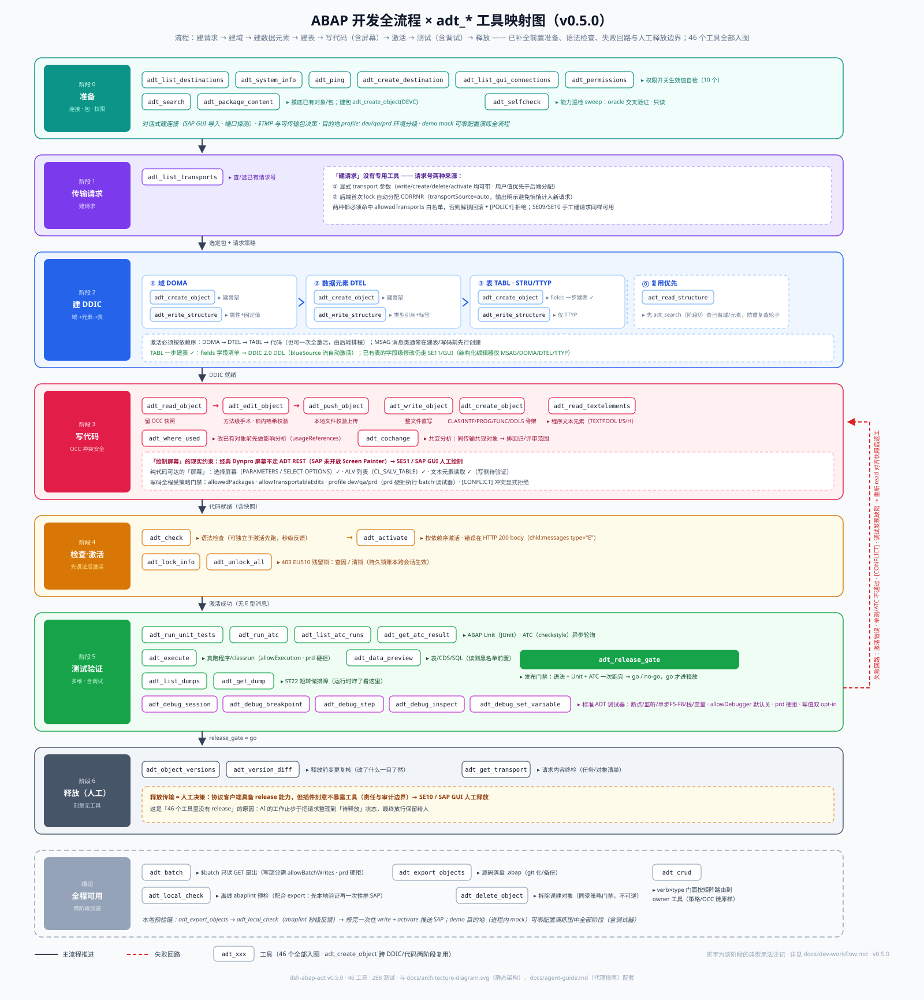

# ABAP 开发全流程 × adt_* 工具映射

原始流程：**建请求 → 建域 → 建数据元素 → 建表 → 写代码（含绘制屏幕）→ 激活 → 测试 → 释放请求**

该流程主干正确，但有遗漏与两处硬约束。补全后如上图，32 个 `adt_*` 工具（0.9.0）全部归位。

## 遗漏与修正

| # | 遗漏点 | 说明 |
|---|---|---|
| 1 | **前置准备阶段** | 连接目的地（对话式建连 / SAP GUI 导入）、确认包与权限策略（`allowedPackages` / `$TMP` / `profile: dev·qa·prd` 环境分级）、摸底已有对象、能力巡检——全程前置 |
| 2 | **「建请求」没有专用工具** | 请求号两种来源：① 显式 `transport` 参数（用户值优先）；② 后端首次 lock 自动分配 CORRNR（`transportSource=auto`，输出明示）。两者都必须命中 `allowedTransports` 白名单，否则解锁回滚 + `[POLICY]` 拒绝 |
| 3 | **DDIC 依赖链不完整** | 除 DOMA→DTEL→TABL 外，通常还需要 MSAG（消息类）、TTYP（表类型）、STRU（结构）；且应**先搜索复用**已有域/元素（防重复造轮子） |
| 4 | **建表已支持一步建**（一步 DDL 流） | `adt_object_write` 传 `fields` 字段清单 → 生成 DDIC 2.0 DDL → blueSource 流自动激活；**已有表**的字段级修改仍不在结构化编辑器内（仅 MSAG/DOMA/DTEL/TTYP）——走 SE11/GUI |
| 5 | **屏幕的硬约束** | 经典 Dynpro 屏幕不走 ADT REST（SAP 未开放 Screen Painter）→ SE51/SAP GUI 人工绘制。纯代码可达的替代：选择屏幕（`PARAMETERS`/`SELECT-OPTIONS`）、ALV（`CL_SALV_TABLE`）；文本元素可读（`adt_object_read {part:'textelements'}`，写侧待真实系统验证） |
| 6 | **写码前影响分析** | 改已有对象先 `adt_where_used`；同传输共变的对象用 `adt_cochange` 排回归/评审范围；编辑走 OCC 三段式 read→edit（baseHash 冲突检测），支持方法级手术与 sourceFile 本地文件推送 |
| 7 | **激活前语法检查** | `adt_check` 独立于激活可先跑（秒级反馈，未激活也能查） |
| 8 | **测试维度与失败回路** | Unit/ATC 之外：`adt_execute`（真跑）、`adt_data_preview`（数据验证，读侧敏感表黑名单前置）、`adt_dumps`（ST22 排障：无 dumpId=列表 / 带dumpId=详情）、**`adt_debug`**（标准 ADT REST 调试器：断点/监听/单步/栈/变量，一个工具九个 action）；失败沿回路返工，而非线性走完 |
| 9 | **释放 = 人工** | 客户端具备 release 能力但**刻意不设工具**（责任与审计边界）；释放前用 versions/diff 复核、`adt_transports {number}` 终检请求内容 |

## 工具 → 阶段映射（32 个全部入图）

| 阶段 | 工具 |
|---|---|
| **0 准备**（连接 · 包 · 权限 · 巡检） | `adt_list_destinations` `adt_system_info` `adt_ping` `adt_create_destination` `adt_list_gui_connections` `adt_permissions` `adt_selfcheck` `adt_search` `adt_object_read {type:'DEVC'}`（包成员；建包 `adt_object_write` DEVC） |
| **1 传输请求**（建请求） | `adt_transports`（无 number=列表查/选已有请求号；新请求号 = 显式 `transport` 或 lock 自动分配） |
| **2 建 DDIC**（域→元素→表） | `adt_object_write`（DOMA/DTEL/TABL+fields/STRU/TTYP/MSAG，含 structured 面与 fields 一步 DDL 流） `adt_object_read/edit`（structured 面读写已有） |
| **3 写代码**（OCC · 屏幕策略） | `adt_object_read`（方法窗口+契约序言）→ `adt_object_edit`（方法级手术 / sourceFile）→ `adt_object_write`（CLAS/INTF/PROG/FUNC/DDLS 骨架）、`adt_object_read {part:'textelements'}`、`adt_where_used` + `adt_cochange`（改前影响/共变分析） |
| **4 检查·激活** | `adt_check` → `adt_activate`；锁旁路：`adt_lock_info` `adt_unlock_all`（EU510 残留锁） |
| **5 测试验证**（含调试） | `adt_run_unit_tests` `adt_run_atc` `adt_atc_runs`（无 displayId=列表 / 带 displayId=单结果） `adt_execute` `adt_data_preview` `adt_dumps`；调试器：`adt_debug`（listen/status/detach/断点/单步/变量/栈/setVariable）；门禁：`adt_release_gate` |
| **6 释放**（人工决策） | `adt_object_versions` `adt_version_diff`（变更复核）、`adt_transports {number}`（请求终检）；release 本身无工具 |
| **横切**（全程可用） | `adt_batch`（$batch 只读扇出） `adt_export_objects`（源码落盘） `adt_local_check`（离线 abaplint） `adt_object_delete`（拆除误建） |

> 调试器治理：`allowDebugger` 默认关（会停生产进程）、写变量值再需 `allowDebugVariables`（双重 opt-in，`adt_debug` 的 setVariable action）、`profile: prd` 目的地硬拒整族；demo 目的地（进程内 mock）可零配置演练全部阶段（含调试器全链路）。
